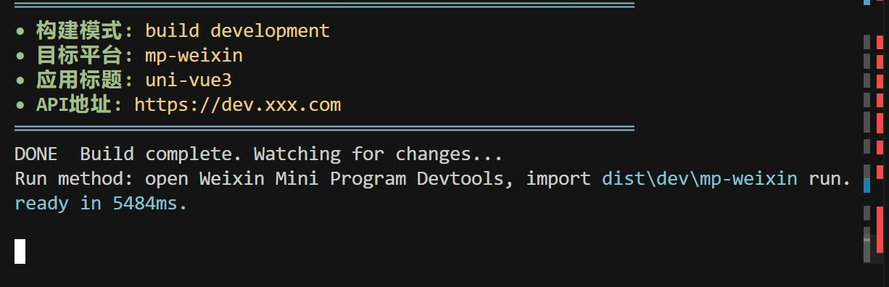

# 2025 最新 uni-app 开发模板

uni-app Vue3 + Vite5 + TypeScript + Pinia + Unocss
使用最新 uni-app vue-cli 模板， vue3、vite 最新版本搭建，通过命令方式运行和打包构建，加入了 unocss 原子化开发方式，极大的提升您的开发效率。

## 技术架构

基于 vue3+vite+uniapp+typescript+unocss

1. 环境要求

node>18.0.0
pnpm>7.0.0

2. 不建议集成第三方组件库

- 由于第三方组件库大部分组件未使用微信原生组件开发，相对原生组件性能较差。对于小程序来说，建议使用原生的组件去开发。当然如果您对性能没有较高的要求，您可以自行选择集成第三方组件库。

2. 快速开始

```
   pnpm install
   pnpm i
   pnpm dev:mp

```

pnpm dev:mp-weixin



3. 调试

- 微信平台：然后打开微信开发者工具，导入上面`pnpm dev:mp-weixin` 生成的本地 dist 文件夹，选择本项目的`dist/dev/mp-weixin` 文件。

4. 发布

- 微信平台：`pnpm build:mp-weixin`, 打包后的文件在 `dist/build/mp-weixin`，然后通过微信开发者工具导入，并点击右上角的"上传"按钮进行上传。

## 注意

- 如果不想在pages页面中单独引入组件，全局组件可以放到uni-module模块下，这也是符合uni-app easycom的规范
- 业务ts类型放到对应的pages对应文件type.ts中

## 联系我

- +v：qq8181227（疑难解答，也接前端项目开发）

## 性能优化说明

本项目已经实施了多种性能优化策略，提升应用的加载速度和运行效率：

### 构建优化

1. **代码分割**：

   - 使用 `manualChunks` 将代码分割成更小的块
   - 第三方依赖单独分组，提高缓存效率

2. **资源优化**：

   - 使用 `vite-plugin-imagemin` 压缩图片资源
   - 设置合理的 `assetsInlineLimit` 控制小文件内联
   - 采用 `lightningcss` 进行更高效的 CSS 压缩

3. **Sass 优化**：
   - 配置 CSS 输出压缩
   - 使用 `@use` 替代 `@import` 解决警告

### 运行时优化

1. **渲染优化指令**：

   - `v-lazy`：图片懒加载指令
   - `v-if-visible`：条件渲染优化
   - `v-virtual-scroll`：虚拟滚动

2. **性能监控**：
   - `monitorRenderPerformance`：渲染性能跟踪
   - `monitorMemoryUsage`：内存使用监控
   - `detectRerender`：组件重渲染检测
   - `reportPageLoadPerformance`：页面加载性能报告

### 使用方法

```js
// 导入性能监控工具
import { monitorRenderPerformance } from "@/utils/performance"

// 监控性能
const perf = monitorRenderPerformance()
perf.markTime("开始初始化")
// ... 执行代码 ...
perf.markTime("初始化完成")
perf.measureTime("开始初始化", "初始化完成")
```
